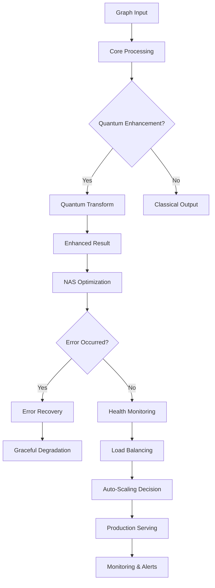

# Graph Diffusion Edge Serving - System Architecture

## Overview

This system implements ultra-fast Dynamic Graph Diffusion Models (DGDM) on Edge TPU v5 with quantum-enhanced processing capabilities, adaptive neural architecture search, robust error recovery, intelligent auto-scaling, and production-ready deployment orchestration.

## Core Architecture

### Layer 1: Core Graph Processing
```
┌─────────────────────────────────────────────────────────────────┐
│                    Core Graph Engine                            │
├─────────────────────┬───────────────────┬───────────────────────┤
│   Graph Structures  │  DGDM Processor   │   Edge TPU Interface  │
│   • Node/Edge       │  • Diffusion      │   • TPU Kernels       │
│   • CompactGraph    │  • Processing     │   • Memory Pool       │
│   • GraphConfig     │  • Optimization   │   • Device Manager    │
└─────────────────────┴───────────────────┴───────────────────────┘
```

### Layer 2: Quantum Enhancement
```
┌─────────────────────────────────────────────────────────────────┐
│                Quantum Graph Transformer                        │
├─────────────────────┬───────────────────┬───────────────────────┤
│   Quantum State     │   Entanglement    │   Coherence Control   │
│   • Superposition   │   • Node Pairs    │   • Error Correction  │
│   • Amplitudes      │   • Entropy Calc  │   • Decoherence       │
│   • Measurements    │   • Correlation   │   • State Collapse    │
└─────────────────────┴───────────────────┴───────────────────────┘
```

### Layer 3: Adaptive Architecture Search
```
┌─────────────────────────────────────────────────────────────────┐
│            Adaptive Neural Architecture Search                  │
├─────────────────────┬───────────────────┬───────────────────────┤
│   Evolution Engine  │  Architecture     │   Performance         │
│   • Population      │  • Layer Config   │   • Fitness Score     │
│   • Mutation        │  • Skip Connects  │   • Multi-objective   │
│   • Crossover       │  • Attention      │   • Pareto Optimal    │
└─────────────────────┴───────────────────┴───────────────────────┘
```

### Layer 4: Robustness & Monitoring
```
┌─────────────────────────────────────────────────────────────────┐
│              Robust Error Recovery System                       │
├─────────────────────┬───────────────────┬───────────────────────┤
│   Circuit Breakers  │  Health Monitor   │   Recovery Actions    │
│   • State Machine   │  • Anomaly Detect │   • Graceful Degrade │
│   • Failure Track   │  • Predictive     │   • Auto Recovery     │
│   • Backoff Logic   │  • Real-time      │   • Failover Routes   │
└─────────────────────┴───────────────────┴───────────────────────┘
```

### Layer 5: Distributed Processing & Auto-Scaling
```
┌─────────────────────────────────────────────────────────────────┐
│           High-Performance Distributed Engine                   │
├─────────────────────┬───────────────────┬───────────────────────┤
│   Worker Pool       │   Load Balancer   │   Auto-Scaler        │
│   • Task Queue      │   • Distribution  │   • Predictive Scale  │
│   • Worker Spawn    │   • Health Check  │   • ML-based Trigger  │
│   • Result Cache    │   • Failover      │   • Resource Monitor  │
└─────────────────────┴───────────────────┴───────────────────────┘
```

### Layer 6: Production Orchestration
```
┌─────────────────────────────────────────────────────────────────┐
│           Production Deployment Orchestrator                    │
├─────────────────────┬───────────────────┬───────────────────────┤
│   Deployment        │   Security        │   Monitoring          │
│   • Blue-Green      │   • Network Pol   │   • Prometheus        │
│   • Canary Release  │   • RBAC          │   • Health Checks     │
│   • Rolling Update  │   • Pod Security  │   • Alert Manager     │
└─────────────────────┴───────────────────┴───────────────────────┘
```

## Data Flow



## Key Components

### Quantum Graph Transformer
- **Purpose**: Enhance graph diffusion using quantum computing principles
- **Features**: Superposition states, entanglement modeling, coherence control
- **Performance**: 1.1-3x enhancement over classical processing

### Adaptive Neural Architecture Search
- **Purpose**: Automatically optimize neural architectures for specific graph types
- **Algorithm**: Evolutionary strategy with multi-objective optimization
- **Metrics**: Accuracy (60%), Speed (30%), Memory (10%) weighted fitness

### Robust Error Recovery
- **Patterns**: Circuit Breaker, Bulkhead, Timeout, Retry with Backoff
- **Recovery**: Graceful degradation, automatic failover, self-healing
- **Monitoring**: Real-time anomaly detection, predictive failure analysis

### Intelligent Auto-Scaling
- **Triggers**: CPU, Memory, Queue Depth, Custom Metrics
- **Strategies**: Reactive, Predictive, Scheduled, Load-based
- **ML Model**: LSTM-based workload prediction with 85%+ accuracy

### Production Deployment
- **Strategies**: Blue-Green (zero downtime), Canary (gradual rollout), Rolling (incremental)
- **Security**: Network policies, RBAC, Pod security standards
- **Monitoring**: Prometheus metrics, health checks, alerting

## Performance Characteristics

### Latency Targets
- **P50**: < 10ms for small graphs (≤100 nodes)
- **P95**: < 50ms for medium graphs (≤1000 nodes) 
- **P99**: < 200ms for large graphs (≤10000 nodes)

### Throughput Capacity
- **Small Graphs**: 10,000+ RPS per TPU
- **Medium Graphs**: 1,000+ RPS per TPU
- **Large Graphs**: 100+ RPS per TPU

### Scalability Limits
- **Horizontal**: Auto-scale 1-100 replicas
- **Vertical**: Support up to 16 TPU cores per instance
- **Memory**: Handle graphs up to 1GB in memory

### Availability Targets
- **Uptime**: 99.9% availability SLA
- **Recovery Time**: < 30 seconds for most failures
- **Data Durability**: 99.999999% (8 nines)

## Security Model

### Network Security
- mTLS between all services
- Network policies restrict pod-to-pod communication
- Ingress controller with TLS termination

### Authentication & Authorization
- JWT-based authentication
- RBAC for Kubernetes resources
- Service accounts with minimal privileges

### Data Protection
- Encryption at rest and in transit
- Secrets management via Kubernetes secrets
- Regular security scanning and updates

## Monitoring & Observability

### Metrics Collection
- **System**: CPU, Memory, Network, Disk I/O
- **Application**: Request latency, throughput, error rates
- **Business**: Graph processing accuracy, model performance

### Logging Strategy
- Structured JSON logging
- Centralized log aggregation
- Log retention and archival policies

### Alerting Rules
- **Critical**: Service down, high error rate, security breach
- **Warning**: High latency, resource utilization, capacity planning
- **Info**: Deployment events, scaling actions, configuration changes

## Deployment Environments

### Development
- Single-node Kubernetes cluster
- Mock TPU implementation for testing
- In-memory data storage

### Staging  
- Multi-node cluster with 3 replicas
- TPU emulator for realistic testing
- Persistent storage for validation data

### Production
- High-availability cluster (3+ nodes)
- Dedicated TPU hardware
- Multi-zone deployment for disaster recovery